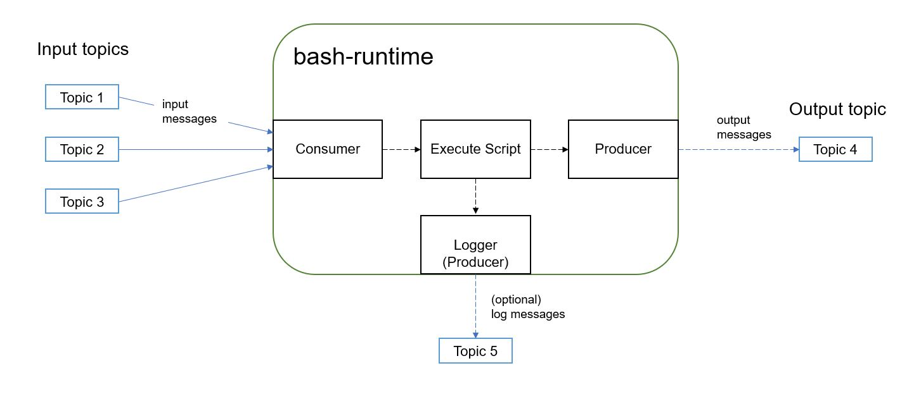

# Bash Runtime

A bash runtime based on [Apache Pulsar](https://pulsar.apache.org/docs/en/concepts-overview/).

It has below features:

- process messages in given IN_TOPICS and produce result to given OUT_TOPIC
- support multiple input topics, combined them with commas in the IN_TOPICS
- support log topic by specifying the LOG_TOPIC
- support parallel processing by running multiple instances
- override the default script with your own one by editing the `scripts/exec.sh`
- support docker and k8s

## How to use

```shell
go mod download
make run 
# or build it first
make build
./build/bash-runtime
```

You can set some environments to override default parameters before run the program:

```shell
export PULSAR_URL="pulsar://localhost:6650"
export OUT_TOPIC="bash-runtime-out" # output topic
export LOG_TOPIC="bash-runtime-log" # log topic, set it to empty if you don't want it
export IN_TOPICS="bash-runtime-in-1,bash-runtime-in-2" # input topics, separated by commas
export SUBSCRIPTION="bash-runtime-sub" # subscription name
```

Now send some messages to the input topics:

```shell
[raja@nccddev130026 apache-pulsar-2.9.1]$ bin/pulsar-client produce persistent://public/default/bash-runtime-in --num-produce 1 --messages "Hello world"
...
2022-04-01T16:48:27,836+0800 [main] INFO  org.apache.pulsar.client.cli.PulsarClientTool - 1 messages successfully produced

```

You can see the processed messages in the OUT_TOPIC
```shell
[raja@nccddev130026 apache-pulsar-2.9.1]$ bin/pulsar-client consume persistent://public/default/bash-runtime-out --subscription-name my-subscription --num-messages 0
...
----- got message -----
key:[null], properties:[], content:Hello world!
```

(Optional) You can also see the log if you don't disable it:
```shell
[raja@nccddev130026 apache-pulsar-2.9.1]$ bin/pulsar-client consume persistent://public/default/bash-runtime-log --subscription-name my-subscription --num-messages 0
...
----- got message -----
key:[null], properties:[], content:time="2022-04-01T08:47:13Z" level=info msg="process message 'Hello world' successfully"
```

### Use Docker or k8s

You can also use docker or k8s to run the program.

There is already a built image pushed to my [repo](https://hub.docker.com/repository/docker/jiangpch/bash-runtime/general)

```shell
# update below environments first
docker run -td --name runtime2 \
 -e PULSAR_URL=pulsar://{YOUR_PULSAR_URL} \
 -e OUT_TOPIC={OUT_TOPIC} \
 -e LOG_TOPIC={LOG_TOPIC} \
 -e IN_TOPICS={IN_TOPICS} \
 -e SUBSCRIPTION={SUBSCRIPTION_NAME} \
 jiangpch/bash-runtime
```

You can overwrite the `scripts/exec.sh` by mount a volume to the container:

```shell
mkdir scripts
# create an exec.sh under scripts/
chmod +x scripts/exec.sh

docker run -td --name runtime2 \
 -v ~/scripts:/root/bash-runtime/scripts \
 -e PULSAR_URL=pulsar://{YOUR_PULSAR_URL} \
 -e OUT_TOPIC={OUT_TOPIC} \
 -e LOG_TOPIC={LOG_TOPIC} \
 -e IN_TOPICS={IN_TOPICS} \
 -e SUBSCRIPTION={SUBSCRIPTION_NAME} \
 jiangpch/bash-runtime
```

or you can choose to build a custom image with your bash script:

```dockerfile
FROM jiangpch/bash-runtime:latest

# write your own exec.sh, and execute `chmod +x` for it
ADD exec.sh scripts/exec.sh
```

There is a simple [StatefulSet.yaml](./yaml/statefulset.yaml) which you can use to create a StatefulSet on k8s:
```shell
k8s apply -f yaml/service.yaml
k8s apply -f yaml/statefulset.yaml # update the default environments first
```

## Structure



The project creates:
1. a consumer to subscript all input topics, and retrieve messages from them
2. a producer to send processed message to output topic
3. a producer to send log messages to log topic when configured
4. a bash script executor to exec the script

## Test

```shell
# below will only run tests which do not require a running pulsar instance
make test

# below will run all tests, and some of them require a running pulsar
# so start one before execute below command
# the installation can refer to: https://pulsar.apache.org/docs/en/standalone/
make system-test
```
